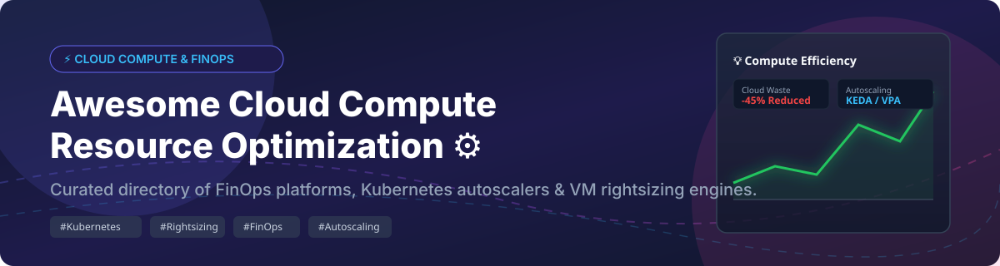

# Awesome-Cloud-Compute-Resource-Optimization

# Awesome-Cloud-Compute-Resource-Optimization ⚙️ 📉



  





  
  
  
  
  
  



---

## 🌟 Top Cloud Compute & Resource Optimization Ecosystem

**Curated List of Commercial Rightsizing Platforms & Open-Source Kubernetes Autoscaling Tools**  
*Focused on VM Rightsizing, Kubernetes Resource Optimization, Spot Instance Automation, Predictive Autoscaling & Self-Hosted Capacity Management*

**Last updated: October 2026** 📅

---

### 📌 Overview & SEO Summary
Welcome to the ultimate curated directory of **cloud compute optimization platforms**, **open-source Kubernetes rightsizing tools**, and **autonomous capacity management frameworks**. Whether you are looking for enterprise-grade commercial solutions (such as *AWS Compute Optimizer*, *Cast AI*, and *Turbonomic*), or self-hostable open-source alternatives (like *KRR*, *KEDA*, and *VPA*), this list covers category leaders, bin-packing engines, and privacy-respecting resource optimization.

---

## 📑 Table of Contents
- [🏢 SaaS & Commercial Platforms](#-saas--commercial-platforms)
- [🔓 Open-Source GitHub Projects](#-open-source-github-projects)
- [🛠️ How to Contribute](#%EF%B8%8F-how-to-contribute)
- [📊 Star History](#-star-history)
- [🤝 Support & Sponsorship](#-support--sponsorship)
- [⚠️ Disclaimer](#%EF%B8%8F-disclaimer)

---

## 🏢 SaaS / Commercial Platforms

The cloud compute optimization market spans **free native cloud tools** (AWS Compute Optimizer) that provide baseline recommendations at no cost, and **specialized platforms** that charge per-instance, per-vCPU-hour, or as a percentage of savings realized. **AWS Compute Optimizer** analyzes 14 days of CloudWatch metrics **for free**, with enhanced infrastructure metrics (up to 3 months) costing **$0.0003360215 per resource per hour** (~$0.25/month per continuously running instance) . **Cast AI** charges **$1,000/month base plus $5/vCPU/month** for its Growth tier, with a free Monitoring tier offering unlimited clusters in read-only mode . **Turbonomic** lists **$18.75 per instance per month** for cloud optimization, with Standard tier quote-only and billed as a percentage of managed cloud spend or per managed virtual server . **Densify** prices at **$5,000/month for up to 2,000 IaaS instances** on AWS Marketplace . **Intel Granulate** charges **$0.003 per core per hour** (cloud) or **$5 per core per month** (on-prem) . **Sedai** charges **$10–$20 per instance per month** or a shared-savings percentage, managing over **$3 billion in annual cloud spend** .

| SaaS / Commercial Platform | Company / Owner | Valuation / Market Cap | Standard Edition Starting Price | Free Tier / Free Trial Limits | Description |
| :--- | :--- | :--- | :--- | :--- | :--- |
| **[AWS Compute Optimizer](https://aws.amazon.com/compute-optimizer/)** ☁️ | Amazon | ~$2.0 Trillion | **Free for 14-day recommendations**; enhanced metrics: **$0.0003360215/resource/hour** | **Free forever** for standard recommendations | **AWS-native rightsizing** — ML-based recommendations for EC2, Auto Scaling groups, EBS, Lambda, and RDS. Analyzes 14 days of CloudWatch metrics for free; enhanced metrics analyze **up to 3 months** for ~$0.25/month per instance. Identifies **Graviton migration opportunities** and inferred workloads (EMR, Cassandra, NGINX, PostgreSQL, Redis, Kafka) . |
| **[Cast AI](https://cast.ai/)** 🎯 | Cast AI | Private | **Growth: $1,000/month base + $5/vCPU/month** | **Free (Monitoring): unlimited clusters, read-only recommendations** | **Kubernetes automation and cost optimization** — Automated autoscaling, Spot instance management with interruption prediction, workload rightsizing at millicore level, bin packing, and pod scheduling optimization. **Realized savings** tracked via node autoscaler (bin-packing, Spot adoption, cheaper node types) and **workload autoscaler savings** from rightsizing . |
| **[IBM Turbonomic](https://www.ibm.com/products/turbonomic)** ⚙️ | IBM | ~$200 Billion | **$18.75/month per instance** (Cloud tier) | **30-day free trial** with unlimited optimization | **Application resource management (ARM)** — Public cloud optimization, Kubernetes optimization (EKS, AKS, GKE), and application/database resource optimization. **SLO-driven automation** ensures performance targets. **Standard tier** bills as percentage of cloud spend or per MVS . |
| **[Densify](https://www.densify.com/)** 📊 | Densify | Private | **$5,000/month for up to 2,000 IaaS instances** (AWS Marketplace)  | **Free trial available** | **Cloud and container optimization** — **Optimization-as-code** with ML technology. Makes applications **self-aware of precise resource requirements** and automatically optimizes themselves 24/7. **Kubernetes API** for container recommendations . |
| **[Intel Granulate](https://granulate.io/)** ⚡ | Intel (Acquired) | ~$100 Billion (Intel) | **$0.003/core/hour** (cloud); **$5/core/month** (on-prem)  | **Demo available** | **Autonomous workload optimization** — **No code changes required**. Continuous ML-driven CPU and memory tuning. Claims **up to 45% reduced compute costs**. Available in all hyperscaler marketplaces . |
| **[Sedai](https://www.sedai.io/)** 🤖 | Sedai | Private | **$10–$20/instance/month** or shared-savings percentage  | **14–30 day free trial** with read-only cost telemetry | **Autonomous cloud management** — **Predictive autoscaling** provisions capacity before traffic spikes. **SLO-backed CPU/RAM rightsizing**, Kubernetes HPA/VPA tuning, and AWS Lambda serverless cost reductions. Manages **$3B+ in annual cloud spend** . |
| **[Spot by NetApp (Flexera)](https://spot.io/)** 🟢 | NetApp / Flexera | ~$20 Billion | **$1.415/100 vCPU hours** (managed compute); savings dimensions **$0.001–$0.28/unit** | **Free tier: up to 20 VMs** | **Cloud automation and optimization** — **Ocean** for Kubernetes worker node management with bin-packing and Spot adoption. **Elastigroup** for VM optimization. **Eco** for RI/SP commitment management. Savings-based billing aligns fees with achieved value . |
| **[Kubecost Enterprise](https://www.kubecost.com/)** 💰 | IBM (Kubecost) | Private | Custom enterprise pricing | **Free tier: unlimited clusters, 250 cores or $100K spend cap**  | **Kubernetes cost monitoring and optimization** — Real-time cost allocation, savings recommendations, and multi-cluster visibility. **EKS-optimized bundle is free with no spend cap** and integrates with AWS billing for accurate Savings Plans and RI reconciliation . |
| **[Akamas](https://www.akamas.io/)** 🎛️ | Akamas | Private | Custom enterprise pricing | **Demo available** | **AI-powered performance and capacity optimization** — Automates tuning of JVM, Kubernetes, and cloud infrastructure parameters. Configurable pricing rules for CPU/memory cost calculations . |

---

## 🔓 Open-Source GitHub Projects

*Sorted by GitHub_Stars_Count (Descending)* 🌟

- **[KRR (Kubernetes Resource Recommender)](https://github.com/robusta-dev/krr)**   
  **Prometheus-based Kubernetes resource recommendations**, open-source. **3,233 stars, 177 forks** . **The most popular open-source VPA alternative** — scrapes Prometheus metrics and generates CPU/memory rightsizing recommendations for all workloads. **No VPA installation required** — works entirely from existing Prometheus data. Supports **multi-cluster** analysis via separate Prometheus endpoints. **HTML reports** with per-namespace breakdowns. **Configurable** for different Prometheus setups and namespace filters. **The easiest way to get rightsizing recommendations across an entire cluster** . 🎯

- **[KEDA](https://github.com/kedacore/keda)**   
  **Kubernetes Event-driven Autoscaling**, Apache-2.0 licensed. **CNCF graduated project** — allows fine-grained autoscaling including **scale-to-zero** for event-driven Kubernetes workloads . **50+ built-in scalers** for Cron, CPU, External, MQ, DB, and more. **Serves as Kubernetes Metrics Server** and allows users to define autoscaling rules using a dedicated **Custom Resource Definition (CRD)** . **No external dependencies** — runs on both cloud and edge. Integrates natively with Horizontal Pod Autoscaler (HPA) . 🌊

- **[VPA (Vertical Pod Autoscaler)](https://github.com/kubernetes/autoscaler/tree/master/vertical-pod-autoscaler)**   
  **Automatic CPU and memory rightsizing**, Apache-2.0 licensed. **Sets container resource requests and limits based on observed usage** — reduces over-provisioning and improves cluster utilization. **Recommender mode** for read-only recommendations before enabling auto-updates. **Caution**: VPA and HPA should not target the same metric on the same workload . 📊

- **[Kubernetes HPA (Horizontal Pod Autoscaler)](https://github.com/kubernetes/kubernetes/tree/master/pkg/controller/podautoscaler)**   
  **Kubernetes pod autoscaling**, Apache-2.0 licensed. **Built into Kubernetes core** — scales pod replicas based on CPU utilization, memory, or custom metrics. **Container resource metrics (v1.27 beta)** , **custom metrics (v1.23 stable)** , and **multiple metrics (v1.23 stable)** . Integrates with KEDA for event-driven scaling and with VPA for resource rightsizing. 📈

- **[Kaytu CLI](https://github.com/kaytu-io/kaytu)**   
  **Cloud workload efficiency analyzer**, open-source. **574 stars** . **Analyzes historical usage** and provides **tailored recommendations** such as changing instance sizes. **Ensures you only pay for the resources you actually need without compromising stability** . Go-based CLI for multi-cloud rightsizing. 💻

- **[OpenCost](https://github.com/opencost/opencost)**   
  **Open-source cost monitoring for Kubernetes**, Apache-2.0 licensed. **Originally developed and open-sourced by Kubecost** . Real-time cost allocation by cluster, node, namespace, controller, service, or pod. **Multi-cloud monitoring for AWS, Azure, GCP** with dynamic on-demand pricing from cloud billing APIs. **MCP server built into Helm chart** for AI agent access to cost queries . 🌱

- **[Goldilocks](https://github.com/FairwindsOps/goldilocks)**   
  **VPA recommendations dashboard**, Apache-2.0 licensed. **Provides a web dashboard for viewing VPA recommendations across all namespaces**. Identifies workloads with **mismatched resource requests** and recommends optimal CPU/memory values. **The easiest way to start rightsizing Kubernetes workloads** . 🐻

- **[Cluster Autoscaler](https://github.com/kubernetes/autoscaler/tree/master/cluster-autoscaler)**   
  **Kubernetes cluster scaling**, Apache-2.0 licensed. **Automatically adjusts the size of Kubernetes clusters** when pods fail to schedule due to insufficient resources or when nodes are underutilized. Works with AWS, Azure, GCP, and other cloud providers. **The foundational cluster autoscaler** for Kubernetes. ⚙️

- **[Kubecost Free](https://github.com/kubecost/cost-analyzer-helm-chart)**   
  **Kubernetes cost monitoring and optimization**, Apache-2.0 licensed. **Free tier: unlimited clusters, 250 cores or $100K spend cap over 30 days** . **EKS-optimized bundle is free with no spend cap** and integrates with AWS billing for accurate Savings Plans and RI reconciliation . 💰

- **[AI-Powered Cloud Platform (Go)](https://github.com/ameypant13/AI-Powered-Cloud-Platform)**   
  **AI-driven cloud resource optimization prototype**, open-source. **Collects metrics from Prometheus**, analyzes workload patterns using statistical methods, and **clusters similar workloads using K-means** . **Generates resource optimization recommendations** via REST API. Go-based with Gin web framework and Gonum for statistical analysis. **A teaching codebase for building custom rightsizing engines** . 🤖

---

## 🛠️ How to Contribute

Contributions are welcome! Follow these steps to submit new compute optimization platforms or open-source rightsizing software:

1. 🍴 **Fork** the repository.
2. 📝 **Add/edit** entries in `README.md` maintaining table/list structure and formatting.
3. 🔗 Include project title, official website/GitHub link, exact Stars_Count, license, and brief description.
4. 🚀 Submit a **Pull Request** with a descriptive summary of your changes.

---

## 📊 Star History



---

## 🤝 Support & Sponsorship

If you find this cloud compute optimization repository useful, please consider supporting the project:

- ⭐ **Star** this repository to increase visibility!
- 🔀 **Fork** and share with fellow SREs, platform engineers, and open-source advocates.
- ☕ **Sponsor & Buy Me a Coffee**: Support ongoing open-source curation via the [GitHub Sponsor Dashboard](https://github.com/sponsors/ishandutta2007).

---

## ⚠️ Disclaimer

- This is a **community-curated** list — not exhaustive and not an endorsement. ℹ️
- **AWS Compute Optimizer is free for 14-day recommendations** — enhanced metrics cost **$0.0003360215/resource/hour** (~$0.25/month per continuously running instance). **Auto Scaling groups are charged per running EC2 instance**, not per group .
- **Spot by NetApp (Flexera) savings-optimization dimensions** bill at **$0.001, $0.15, and $0.28 per unit** — the fee climbs exactly as the tool succeeds, making monthly totals hard to forecast against a fixed budget .
- **Turbonomic Standard tier** bills as a **percentage of managed cloud spend or per MVS** — costs scale directly with your infrastructure, so a growing fleet pays more each renewal even though the feature set is unchanged. **IBM Expert Labs services are quoted separately** and the platform's learning curve often makes them necessary .
- **Kubecost Free tier** supports **250 cores or $100K spend over 30 days** — the **EKS-optimized bundle removes the spend cap** but still lacks unified multi-cluster visibility .
- Open-source solutions (KRR, KEDA, VPA, Goldilocks) provide self-hosted ownership and transparency, but enterprise-grade SLA guarantees, multi-cloud unified views, and vendor support remain primarily commercial offerings. **Always benchmark rightsizing recommendations against actual application performance** before applying changes to production. ⚙️

---



  <b>Made with ❤️ for SREs, platform engineers, and open-source compute optimization advocates.</b>

